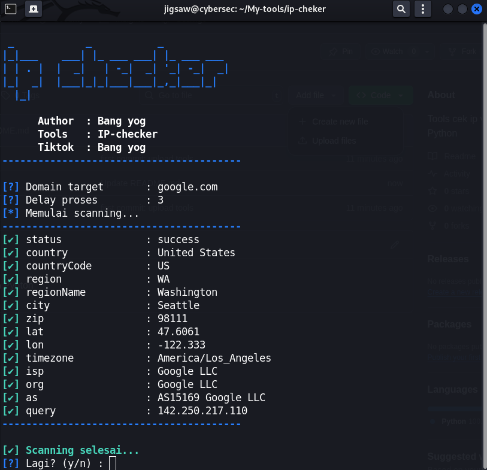

# 🕵️‍♂️ IP Checker

Tools sederhana berbasis Python untuk mengecek informasi IP Address atau domain menggunakan API [ip-api.com](http://ip-api.com).

## ✨ Fitur
- Cek detail informasi IP/Domain (Country, City, ISP, dll).
- Fast & simple (gunakan API gratis).
- Bisa loop terus menerus untuk monitoring.

## 📦 Instalasi

Clone repository ini:
```bash
git clone https://github.com/YogaRmdn/IP-checker.git
cd IP-checker
```
## 📸 Screenshot


