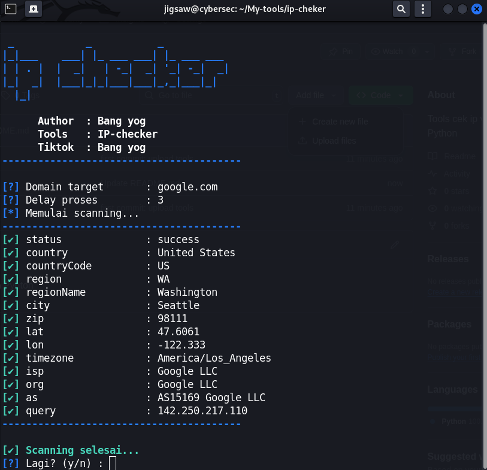

# IP Checker
[](LICENSE) 
[]

A simple Python-based tool for checking IP address or domain information using the [ip-api.com](http://ip-api.com) API.

## Features
- Check detailed IP/Domain information (Country, City, ISP, etc.).
- Fast & simple (use the free API).
- Can be looped continuously for monitoring.

## How to use Tools

Clone repository ini:
```bash
git clone https://github.com/YogaRmdn/IP-checker.git
cd IP-checker
python check.py
```
## 📸 Screenshot


